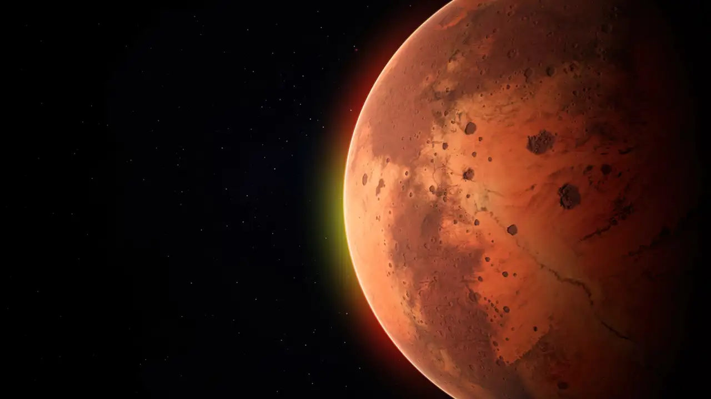

# MarsView 🔴 🚀

## Explorador de imágenes de Marte

MarsView es una aplicación web que permite explorar las fotografías capturadas por los rovers de la NASA en Marte. Ofrece una interfaz intuitiva para visualizar imágenes de diferentes rovers marcianos como Curiosity y Perseverance.



## Características principales

- **Selección de Rovers**: Interfaz para elegir entre diferentes rovers con información detallada.
- **Exploración por Sol**: Navegación por días marcianos (soles) con controles intuitivos.
- **Galería de fotos**: Visualización de imágenes en formato de galería con carga progresiva.
- **Detalles de fotos**: Visualización detallada de cada imagen con información completa.
- **Modo pantalla completa**: Visualización de imágenes a tamaño completo.
- **Diseño responsive**: Adaptable a diferentes tamaños de pantalla.

## Tecnologías utilizadas

- React 
- React Router para navegación
- Fetch API para conexión con NASA Mars Rover Photos API
- CSS para estilos y animaciones
- localStorage para persistencia de datos

## Estructura del proyecto

```
src/
  ├── assets/           # Recursos estáticos
  │   └── rovers/       # Datos de rovers
  ├── components/       # Componentes reutilizables
  │   ├── RoverDetail/  # Componentes para ver detalles de fotos
  │   ├── RoverGallery/ # Componentes para la galería de fotos
  │   └── UI/           # Componentes de interfaz genéricos
  ├── hooks/            # Hooks personalizados
  ├── pages/            # Páginas principales
  │   ├── RoverSelectionPage.jsx # Página de selección de rover
  │   ├── RoverGalleryPage.jsx  # Página de galería de fotos
  │   └── PhotoDetailPage.jsx   # Página de detalle de foto
  ├── services/         # Servicios y APIs
  ├── App.jsx           # Componente principal
  └── main.jsx          # Punto de entrada
```

## API de NASA

La aplicación utiliza la [NASA Mars Rover Photos API](https://api.nasa.gov/) para obtener:

- Manifiestos de los rovers (información general de la misión)
- Fotos de los rovers según sol marciano
- Detalles de cámaras y fechas

## Cómo ejecutar el proyecto

1. Clona el repositorio
   ```bash
   git clone https://github.com/tu-usuario/marsview.git
   cd marsview
   ```

2. Instala las dependencias
   ```bash
   npm install
   ```

3. Inicia el servidor de desarrollo
   ```bash
   npm run dev
   ```

4. Abre tu navegador en `http://localhost:5173`

## Despliegue

Para construir la aplicación para producción:

```bash
npm run build
```

Los archivos compilados estarán disponibles en la carpeta `dist/`.

## Funcionalidades detalladas

### Selección de Rover
- Interfaz visual con información de cada rover
- Estadísticas de misión actualizadas
- Indicador visual de estado (Activo/Inactivo)

### Exploración por Sol
- Controles numéricos para navegar por soles marcianos
- Botones de incremento/decremento (-100, -10, -1, +1, +10, +100)
- Atajos para puntos clave de la misión (0%, 25%, 50%, 75%, 100%)
- Entrada manual de sol específico

### Galería de Fotos
- Vista en cuadrícula con carga progresiva
- Información básica de cada foto
- Navegación a vista detallada

### Detalle de Foto
- Visualización de imagen a mayor tamaño
- Modo pantalla completa
- Metadatos completos (fecha, cámara, información del rover)
- Navegación de regreso a la galería

## Licencia

Este proyecto está bajo la Licencia MIT.

## Créditos

- Imágenes y datos proporcionados por la [NASA Open API](https://api.nasa.gov/)
- Desarrollado con ❤️ para explorar los misterios de Marte 